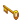
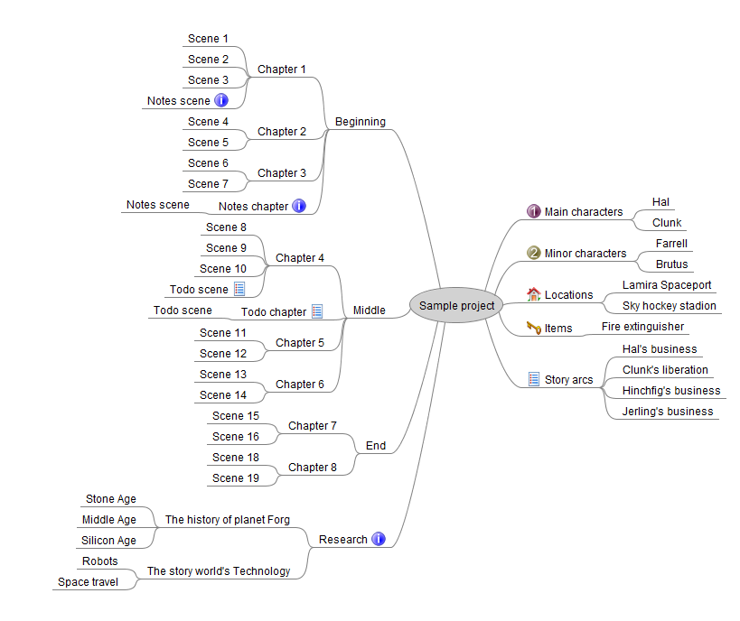

# mm2nw

Generate a NovelWriter project from a FreeMind/Freeplane outline. 

## Features

- Converts three levels of the novel structure: Parts, chapters, and scenes.
- Converts a set of main characters.
- Converts a set of minor characters.
- Converts a set of locations.
- Converts a set of items.
- Makes the node label the title of the converted element.
- Makes the node notes the description of the converted element.
- The chapter/scene types can be set by specified icons.

## Requirements

- [Python](https://www.python.org/) version 3.6+.

## Download link

[https://raw.githubusercontent.com/peter88213/mm2nw/main/mm2nw.py](https://raw.githubusercontent.com/peter88213/mm2nw/main/mm2nw.py)

## Instructions for use

### Intended usage

After placing the downloaded script **mm2nw.py** to a convenient place, you might want to create a shortcut on the desktop. 

If you drag a *.mm* mindmap file with extension *.yw7* and drop it on the icon, a new novelWriter project is generated in a directory named after the mindmap file. 

Existing novelWriter project directories will be renamed as a whole and get the extension *.bak*. 
If there is already such a directory, a new, numbered backup directory is created with the  extension *.bkxxxx*

### Command line usage

Alternatively, you can

- launch the program on the command line passing the mindmap file as an argument, or
- launch the program via a batch file.

usage: `mm2nw.py [-h] [-d] [--silent] Sourcefile`

#### positional arguments:

`Sourcefile` 

The path of the .mm or file. 

#### optional arguments:

`-h, --help` 

show this help message and exit

`--silent` 

suppress error messages and the request to confirm overwriting

## Conversion rules

- Converts elements on three levels of the novel structure: Parts, chapters, and scenes.
- Scene status is *Outline*.
- Converts a set of main characters.
- Converts a set of minor characters.
- Converts a set of locations.
- Converts a set of items.
- Makes the node label the title of the converted element.
- Makes the node notes the description of the converted element.

### The levels of the mindmap tree

- On the first level, a node represents either a *part*, 
  or a collection of characters, locations, or items. The conversion of "Normal type parts" 
  can be suppressed with a configuration file entry, if you just want chapters and scenes. 
- On the second level, a node represents either a *chapter*, or a character/location/item. 
- On the third level. a node represents a *scene*. 

### The use of special icons

The conversion is controlled by nodes decorated with special icons:

#### On the first level

This icon marks the *Main characters* branch: 
 

This icon marks the *Minor characters* branch: 

This icon marks the *Locations* branch: 

This icon marks the *Items* branch: 

#### On the first, second, or third level

This icon makes a node element and its children (if any) *Note* type: 

This icon makes a node element and its children (if any) *Note* type:

### Example mindmap

## Credits

- Frederik Lundh published the [xml pretty print algorithm](http://effbot.org/zone/element-lib.htm#prettyprint).

## License

mm2nw is distributed under the [MIT License](http://www.opensource.org/licenses/mit-license.php).

